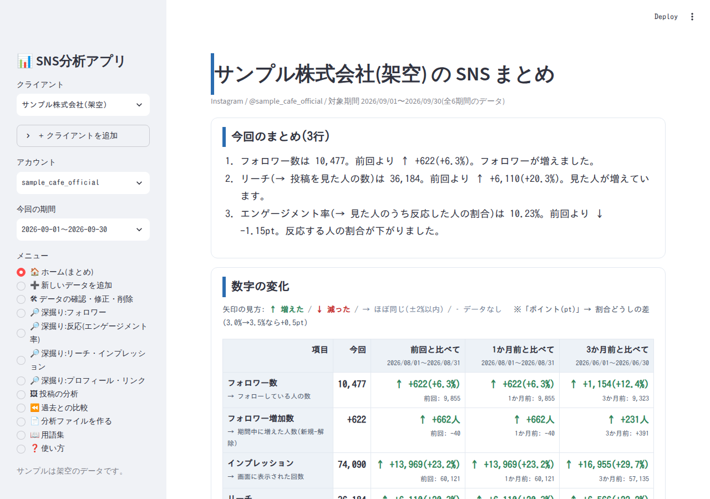
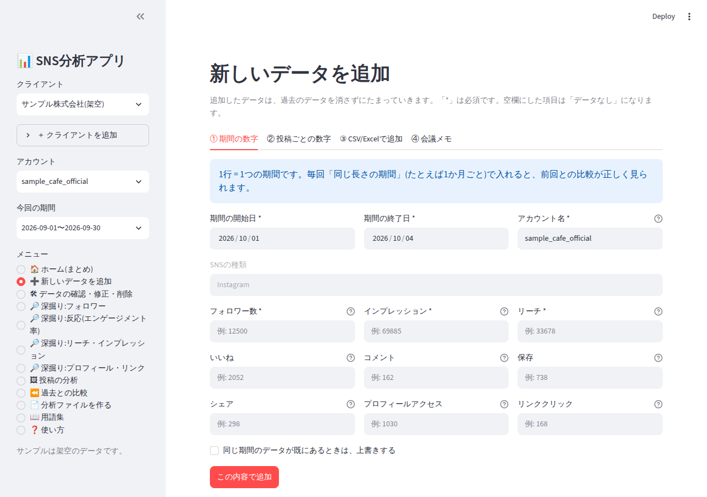
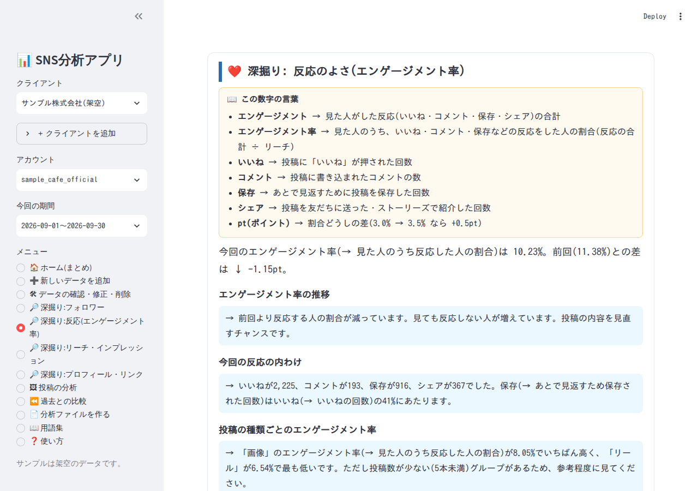
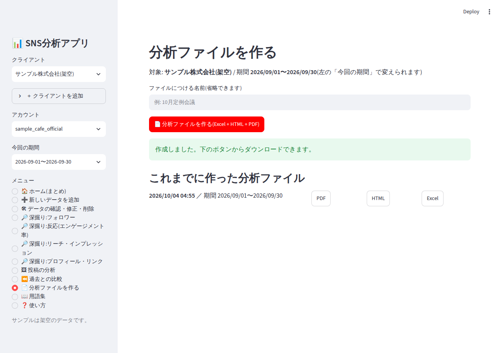

# SNS分析アプリ(Instagram)

SNS運用代行の会議で、**毎回新しい数字を足しながら**使い続けられる分析アプリです。
数字は消えずにたまり、過去との比較・推移が自動で見られます。ボタン1つで **PDF・HTML・Excel** の分析ファイルが作れます。

* 専門用語には必ず「用語 → 意味」の矢印説明が付きます(画面・PDF・Excel共通)。
* 良し悪しは **色と矢印**(<span style="color:#2f855a">↑ 増えた</span> / <span style="color:#c53030">↓ 減った</span> / → ほぼ同じ)で分かります。
* 数字が無い項目は、推測せず **「データなし」** と表示します。



---

## 1. はじめに(最初の1回だけ)

1. **Python 3.10以上** をインストールします(<https://www.python.org/>)。
2. このフォルダ(`sns-analytics`)でターミナル(Windowsは「コマンドプロンプト」)を開き、次の2行を実行します。

```
pip install -r requirements.txt
python -m playwright install chromium
```

2行目は **PDFを作るための部品**を入れる操作です(数分かかります)。

## 2. 起動する(毎回これ1行)

```
streamlit run app.py
```

自動でブラウザが開きます(開かないときは <http://localhost:8501> を開く)。
**初回は架空のサンプルデータが入っている**ので、そのまま全部の画面を試せます。

> 会議で使うときは、ブラウザの画面をそのままZoom/Teamsなどで共有してください。スマホでも見られます。

---

## 3. 毎回の会議の流れ(3ステップ)

```
 ┌──────────────────┐    ┌──────────────────────┐    ┌────────────────────┐
 │ ① 新しいデータを   │ →  │ ② 画面を共有して説明  │ →  │ ③ 分析ファイルを作る │
 │    追加            │    │   ホーム/深掘り4ページ │    │   PDF・HTML・Excel  │
 │ (入力 or CSV)      │    │   (矢印と色で一目で)  │    │   ボタン1つ         │
 └──────────────────┘    └──────────────────────┘    └────────────────────┘
        数字はたまっていく            過去との比較は自動              過去分も一覧から再ダウンロード
```

### ① 新しいデータを追加する

左のメニュー **「➕ 新しいデータを追加」** を開きます。4つのタブがあります。



| タブ | 入れるもの | ポイント |
|---|---|---|
| ① 期間の数字 | 開始日・終了日、フォロワー数、インプレッション、リーチ、いいね、コメント、保存、シェア、プロフィールアクセス、リンククリック | 「*」は必須。**毎回同じ長さの期間(例: 1か月ごと)** で入れると、前回比が正しく出ます。 |
| ② 投稿ごとの数字 | 投稿日(時刻)、種類(画像/動画/リール/ストーリーズ)、テーマ、各数字 | **時刻まで入れる**と、曜日別・時間帯別の比較が出ます。 |
| ③ CSV/Excelで追加 | インサイトから書き出したファイル | 列の対応づけを自動で見つけます。違う列は画面で選び直せます。 |
| ④ 会議メモ | 今回決まったこと・次にやること | 分析ファイルの最後に載ります。 |

* 入力欄には **数字の入力例**(例: 12500)が薄く出ています。カンマ付き(12,500)でもOKです。
* 数字以外・マイナス・必須の入れ忘れは、赤い文字で教えてくれます。
* **空欄にした項目は「データなし」** になります(0にはなりません)。
* 同じ期間・同じ投稿をもう一度入れると「既にあります」と止まります。上書きしたいときだけチェックを入れます。**過去のデータが勝手に消えることはありません。**

#### CSV/Excelの列名について
次のような列名を自動で認識します(日本語・英語どちらも可)。

* 投稿ごと: `投稿日時`(`Publish time`)、`投稿タイプ`(`Post type`)、`リーチ`(`Reach`)、`インプレッション`(`表示`)、`いいね`、`コメント`、`保存`、`シェア`、`プロフィールアクセス`、`リンククリック`、`テーマ`
* 期間ごと: `開始日`、`終了日`、`アカウント名`、`フォロワー数`、上の数字の列

サンプルは `sample/` フォルダにあります(`sample_posts.csv` / `sample_account.csv`)。
投稿タイプは `IG reel` / `リール` / `画像` / `動画` / `ストーリーズ` などを自動で判別します。分からない値の行は、エラーとして行番号つきで教えます。

### ② 画面を共有して説明する

| メニュー | 使いどころ |
|---|---|
| 🏠 ホーム | 今回のまとめ(3行)、数字の変化(↑↓→)、フォロワー推移 |
| 🔎 深掘り 4ページ | **フォロワー / 反応(エンゲージメント率) / リーチ・インプレッション / プロフィール・リンク** を1ページずつ。各ページは「用語の説明 → グラフ+一言コメント → 考えられる理由」の順 |
| 🖼 投稿の分析 | よく見られた投稿ベスト3 / 反応が少なかった投稿ワースト3(理由の仮説つき)、種類別・曜日別・時間帯別 |
| ⏪ 過去との比較 | **前回 / 1か月前 / 3か月前** と今回を並べて表示 |



* 左の **「今回の期間」** を変えると、過去の期間を「今回」として見直せます。
* 複数のクライアントは、左上の **「クライアント」** で切り替えます(＋で追加)。データはクライアントごとに分かれます。
* 「理由」は数字から考えた **仮説** です。断定ではなく、会議で話し合うきっかけとして使ってください。

### ③ 分析ファイルを出す

**「📄 分析ファイルを作る」** → ボタンを1回押すと、次の3つが作られます。

| ファイル | 使いどころ |
|---|---|
| PDF | クライアントへ送る・印刷する |
| HTML | ブラウザで見る・画面共有 |
| Excel | 数字を自分で触りたいとき(シートごとに整理済み、フォロワー推移のグラフ付き) |



* 同じ画面の下に **過去に作ったファイルの一覧** が出て、いつでも再ダウンロードできます。
* ファイルは `output/` フォルダにも保存されます。
* 中身: ① 今回のまとめ3行 ② 数字の変化(前回比・1か月前比・3か月前比) ③ ベスト3/ワースト3と理由の仮説 ④ 種類別・曜日別・時間帯別 ⑤ フォロワー推移 ⑥ 深掘り4ページ ⑦ 次にやること(改善提案3〜5個) ⑧ 用語集
* 見本は `sample/sample_report.pdf` / `sample_report.xlsx` にあります(架空データ)。

---

## 4. 間違えたとき・直したいとき

**「🛠 データの確認・修正・削除」** を開きます。表の数字を直して **「変更を保存」** で修正できます。
消したい行は **「削除」にチェック → 「本当に削除する」にチェック → 「変更を保存」** です(元には戻せません)。

## 5. 保存場所とバックアップ

* 数字はすべて `data/sns.db` に保存され、アプリを閉じても残ります。
* **バックアップは `data/sns.db` をコピーするだけ**です。別のパソコンに移すときも、このファイルを同じ場所に置きます。
* 作った分析ファイルは `output/` にあります。

## 6. 困ったとき

| こんなとき | 対処 |
|---|---|
| PDFが作れない | `python -m playwright install chromium` をもう一度実行。HTMLとExcelは作られているので、先にそちらを使えます。 |
| 「データなし」が多い | その数字が入っていません。空欄の項目を追加すると表示されます。 |
| 前回比が「データなし」 | 比べる相手の期間がありません。同じ長さの期間のデータを増やしてください(1か月前・3か月前は、約1か月前・約3か月前の期間が必要)。 |
| 曜日別・時間帯別が出ない | 投稿ごとのデータに、投稿した **時刻** が入っていません。 |
| CSVが読めない | Excelで開いて「CSV UTF-8」または「xlsx」で保存し直してください。 |

## 7. 数字の見方の約束

* エンゲージメント率 → 見た人のうち、いいね・コメント・保存・シェアをした人の割合(反応の合計 ÷ リーチ)です。4つのうち1つでも数字が無いときは、計算せず「データなし」にします。
* 矢印: ±2%以内は「→ ほぼ同じ」、それより増えれば ↑、減れば ↓ です。割合の差は「pt(ポイント)」で表します(3.0%→3.5% = +0.5pt)。
* 数字の良い目安は、画面の **「📖 用語集」** にあります(業種や規模で変わるため、あくまで目安です)。

---

## 開発者向けメモ

```
sns-analytics/
├─ app.py                # 画面(Streamlit)
├─ requirements.txt
├─ snsapp/
│  ├─ db.py              # SQLite保存(追加・修正・削除)
│  ├─ importer.py        # CSV/Excel取り込み・列の自動対応づけ
│  ├─ metrics.py         # 指標の計算・比較の相手探し
│  ├─ analysis.py        # まとめ・仮説・改善提案の文章づくり
│  ├─ charts.py          # SVGグラフ(画面とPDFで共通)
│  ├─ report.py          # HTML / PDF / Excel 出力
│  ├─ glossary.py        # 用語集(矢印説明の元データ)
│  ├─ sample_data.py     # 架空サンプル
│  └─ style.css
├─ templates/report.html # 画面・レポート共通の部品
├─ data/                 # sns.db(自動作成・git管理外)
├─ output/               # 作成した分析ファイル(git管理外)
└─ sample/               # サンプルCSVと見本レポート
```

* 環境変数 `SNS_DATA_DIR` / `SNS_OUTPUT_DIR` で保存先を変えられます。
* 対応SNSは現在 Instagram のみです(DBには `sns` 列があり、他のSNSの追加は可能な作りです)。
